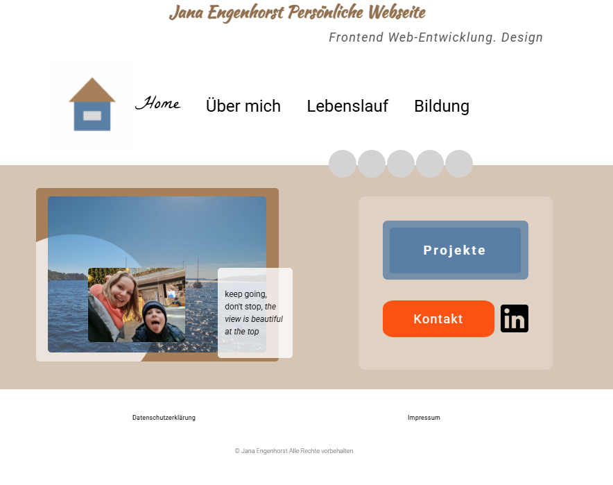

# Persönliche Webseite

Eine persönliche Webseite über die Persönlichkeit, Berufslauf und Bildung

## 🔧 Technologien
- HTML5
- CSS3
- JavaScript (Vanilla)

## 📋 Funktionen
- Responsive Layout für verschiedene Bildschirmgrößen
- Persönliche Portfolio-Webseite mit Informationen über mich    und meine Projekte
- Strukturierte Navigation zwischen den Seiten
- Sauberes und minimalistisches Design
- Mobile-friendly Benutzeroberfläche
- Integration von Projektlinks und Kontaktdaten

## ✨ Besonderheiten

- Fokus auf klares und benutzerfreundliches Design
- Entwickelt als persönliche Portfolio-Webseite
- Optimiert für eine übersichtliche Darstellung auf mobilen Geräten

## 🚀 Live Demo
https://personal-page-jana-engenhorst.netlify.app

## 📦 Installation
Projekt lokal starten:
1. Repository klonen
2. `index.html` im Browser öffnen

## 📸 Screenshot

